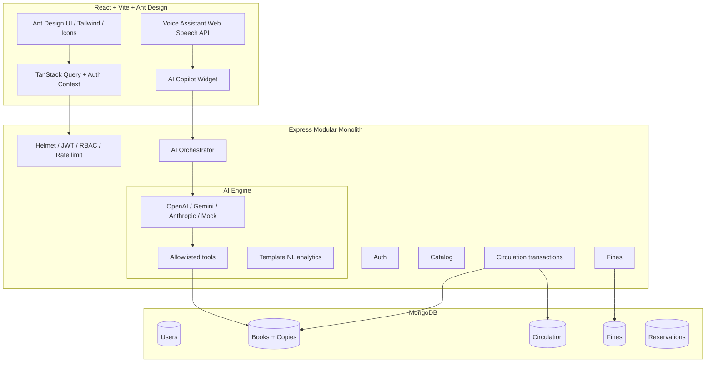

# Architecture

## Circulation transaction

`issue`, `return`, and `renew` run inside `mongoose.startSession()`:

1. Validate member status, borrow cap, unpaid-fine threshold.
2. Mutate copy status (`AVAILABLE` → `ISSUED` / `RESERVED`).
3. On return, compute deterministic fines (grace + daily rate + cap).
4. If a FIFO reservation exists, hold the copy 48h and notify the next member.

## JWT

- Access token: 15 minutes (Authorization Bearer)
- Refresh token: HTTP-only cookie, 7 days, rotated on every `/auth/refresh`
